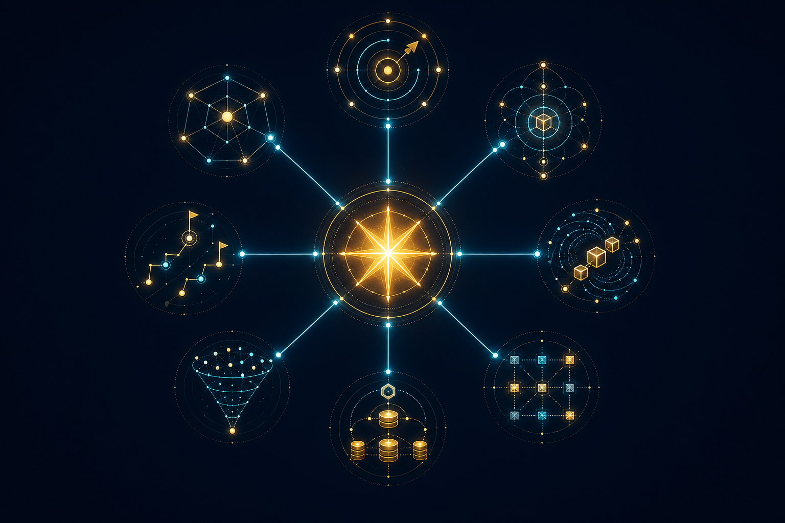

# 创客星球(CGHub)（Creators Galaxy Hub(CGHub)）项目全景知识库

> 品牌命名：中文统一使用“创客星球(CGHub)”，英文统一使用“Creators Galaxy Hub(CGHub)”。英文版见：`docs/07-english/CGHub_Project_Knowledge_Base_EN.md`。


> 本文档是创客星球(CGHub)项目的核心知识库，涵盖所有战略决策、核心理念、内容框架和运营体系。
> 由AI助理维护，随项目进展持续更新。
> 
> **最后更新：2025年**



---

## 一、项目定位

### 1.1 一句话定位

**人类文明未来生态探路者与新型组织协作关系构建者们共创共建共治共享的实践基地**

> ⚠️ **定位说明**：
> - ✅ 人类文明发展方向与人类命运共同体理念探路者的精神家园
> - ✅ AI驱动生产力跃迁背景下，新型生成、组织、社会和分配关系的变革者实践基地
> - ✅ AI新时代创客们共创共建共治共享的创新孵化基地

### 1.2 愿景

**天下大同、万物共生**

### 1.3 使命

**创新实践人类命运共同体蓝图，为人类文明的未来形态探路**

### 1.4 理念

**敬天爱人、革知善行、至简至美**

### 1.5 价值观

**诚信尊重、包容感恩、厚德自强**

### 1.6 行动宣言

**探索驾驭AI生产力变革，破解社会达尔文主义丛林法则，推动共同富裕的幸福安康盛世**

### 1.7 Slogan

**点燃创客之光，点亮未来梦想**

### 1.9 时代号角（对外传播钩子）

> 旧世界的规则正在崩塌，你不再只是旁观者。带上你的热爱，上船，一起迎接新未来。

> ⚠️ **使用场景**：对外传播、社交媒体、开口话术——当有人问「这是什么」时，用这句话回应。

### 1.8 船票叙事（核心叙事）

```
创客星球CGHub = 登录未来美好生活的宇宙飞船船票

登船 = 获得船票 = 共享人类文明美好未来的共识证明

本质 = 同DAO中人的共识证明
飞船由大家共建，成就由大家共享
贡献记录在链上，不可篡改

核心要表达：
竞争关系是弱后的生产关系
未来是：共创共享、和合共生
```

### 1.9 核心理念公式


```
AI生产力 × Web3生产关系 × 共同富裕理念
                 ↓
          创客星球(CGHub)
```

### 1.4 价值观

- **参与者即股东** — 不管持有多少代币，都是共建者
- **创造即确权** — 每份贡献都被记录，都将获得回报
- **规则即代码** — 智能合约自动执行，平台无权单方面修改
- **退出即清算** — 离开时贡献的价值不会消失

---

## 二、理论根基：为什么是现在？

### 2.1 马克思主义基本原理

> "生产力决定生产关系，生产关系反作用于生产力。"
> — 马克思主义政治经济学

**当生产力发展到一定阶段，必须要求生产关系随之变革。**

### 2.2 四次工业革命的生产关系演进

| 革命 | 核心技术 | 生产力变革 | 生产关系变革 |
|------|---------|-----------|------------|
| 第一次 | 蒸汽机 | 机器代替人工 | 资本主义生产关系确立 |
| 第二次 | 电气 | 生产力再爆发 | 垄断资本主义 |
| 第三次 | 互联网 | 信息革命 | 平台资本主义 |
| 第四次 | AI | 个人生产力暴增 | **？？？（这是我们的机会）** |

### 2.3 纳瓦尔杠杆理论

**为什么现在是普通人翻身的机会？**

| 杠杆 | 过去 | 现在（AI时代） |
|------|------|---------------|
| 劳动力杠杆 | 需雇人=需要资本 | AI数字员工/Agent=零成本劳动力 |
| 资本杠杆 | 需有钱=VC/PE | 难突破（仍是门槛） |
| 代码杠杆 | 需团队开发=需要资本 | AI编程=低成本/零门槛 |
| 媒体杠杆 | 官媒=需背景关系 | 自媒体=零门槛人人可做 |

**核心结论：**
- 过去：四大杠杆全部需要资本，普通人根本无法逾越
- 现在：AI打破了劳动力、代码、媒体三大杠杆
- **不需要资金也可以做事情，普通人迎来了翻身机会**

### 2.4 时代背景

- **经济环境不好**：就业压力大、百姓焦虑
- **国家口号**：共同富裕——但如何落地？
- **创客星球(CGHub)的使命**：用共创共建的方式，让普通人也能参与创业、分享红利
- **这不是生意，是一场社会实验**：用Web3技术+共同富裕理念，探索共同富裕的落地路径
- **一句话定位**：帮国家分忧，帮百姓解困，用技术创新实现共同富裕

---

## 三、核心洞察：超级个体更需要组织革命


### 3.1 反驳"AI一人公司不需要组织"的论述

> "AI时代，一人公司盛行，还需要团队吗？还需要组织吗？"
> 这个问题，暴露了对新时代最常见的误解。

**AI解决的是"做事"的问题，但解决不了"成事"的问题。**

| | AI能做的 | AI做不到的 |
|---|---|---|
| **执行层** | 写代码、写文案、做设计、分析数据 | **裂变传播、网络效应、信任传递** |
| **个人** | 一个人完成一支团队的工作 | 一个人的触达上限在哪里 |
| **工具** | AI是超级放大器 | 放大的是能力，但能力本身不会自动扩散 |

**超级个体 = 超级IP + AI数字员工**

```
一个人+AI = 能做
一个人+AI+创客星球(CGHub)组织 = 能做大
```

**为什么裂变和传播，依然需要组织？**

1. **网络效应需要节点** — AI可以放大单点能力，但无法自己形成网络。创客星球(CGHub)的DAO结构，让每个超级个体都是网络节点，节点连接节点，形成指数级裂变。

2. **信任需要传递** — 一个人影响1000人，创客星球(CGHub)让1000个超级个体互相背书，共同影响100万人。信任的叠加，是AI做不到的。

3. **组织是最强的杠杆** — 纳瓦尔说"代码和媒体是新杠杆"。但更准确的表述是：**有组织的代码和媒体，才是新杠杆**。一个人写代码，力量有限；一个DAO协同写代码，力量是前者的N次方。

**这不是在否定一人公司，而是在回答：一人公司之后，下一步是什么？**

> 超级个体解决的是生产力问题。
> 创客星球(CGHub)解决的是生产关系问题。
> 
> **一人公司 + 创客星球(CGHub) = 生产力与生产关系的完美闭环**

AI时代，一人公司盛行，恰恰更需要新的组织范式。因为AI让我们能做事，而创客星球(CGHub)让我们的事被看见、被传播、被放大。

### 3.2 知识星球的重新定位

- **过去vs现在**：
  - 过去：知识星球 = 学知识的平台
  - 现在：知识星球 = **寻找机会、实现价值、获得收益**的平台
- **AI大火+知识大爆炸**：人们去知识星球不是为了学知识，而是寻找实现自我、创造价值、获得收益的机会

### 3.3 过去vs现在的机会对比

| | 过去（资本时代） | 现在（AI时代） |
|---|---|---|
| 参与早期项目 | 资本/VC/PE的专属游戏 | 创客星球(CGHub)让普通人也能参与 |
| 价值捕获 | 只有成熟期才能买入股票 | 萌芽期就能参与，获得早期股份/股权/期权收益 |
| 创业门槛 | 需要组建团队、融资 | AI打破三大杠杆，零门槛启动 |

---

## 四、Web3/区块链设计

### 4.1 代币体系

- **MKT** — 功能型代币
- **STAR** — 治理型代币

### 4.2 上链计划

- 暂不上链（待法规明确）
- 智能合约预留接口
- 代币体系已设计完毕

### 4.3 区块链的核心价值

| 生产关系要素 | Web3表达 |
|------------|---------|
| 所有权 | 私钥确权 |
| 契约关系 | 智能合约 |
| 信用记录 | 链上不可篡改 |
| 分配机制 | 代码自动执行 |
| 治理结构 | DAO投票 |

---

## 五、项目矩阵（6个子项目）

| 项目 | 内容 | 机会等级 |
|------|------|---------|
| 新时代家风建设与传承 | 家庭文化传承 | 🔥 |
| 宠物经济 | 遛狗喂猫+社交电商 | 🔥🔥🔥 |
| 体育社交运动 | 跑友/马拉松/运动 | 🔥🔥 |
| 闲置共享+技能互助 | 邻里二手+悬赏办事 | 🔥🔥 |
| 本地话题UGC | 聊我们的社区 | 🔥🔥 |
| 意林社区 | 总项目，整合上述子项目 | 🔥🔥🔥 |

---

## 六、定价策略

| 产品 | 价格 | 定位 |
|------|------|------|
| 小报童文章 | 10元/篇 | 低门槛引流 |
| 知识星球社群 | 100元/人 | 深度转化+早期期权 |
| 未来独立平台 | 期权价值 | 最终目标 |

---

## 七、内容联动体系


### 7.1 引流路径

```
公众号（首发战斗檄文/社会问题+价值观感召）
       ↓
小报童（5篇文章覆盖项目详情）
       ↓
知识星球（深度社群/找机会+早期期权）
```

### 7.2 内容节奏（5天计划）

- **Day1**：第1篇发刊词
- **Day2**：第2篇时代背景 + 第3篇项目介绍
- **Day3**：第4篇技术解读 + 第5篇行动指南
- **Day4**：公众号首发文 + 知识星球手册
- **Day5**：配图建议 + 查漏补缺

### 7.3 小报童文章框架

| 篇序 | 标题 | 内容 |
|------|------|------|
| 第1篇 | 发刊词 | 创客星球(CGHub)是什么，为什么做这件事 |
| 第2篇 | 时代背景 | AI崛起、超级个体、生产力与生产关系 |
| 第3篇 | 项目介绍 | 6大项目矩阵、机会、玩法 |
| 第4篇 | 技术解读 | Web3、区块链、代币体系、DAO治理 |
| 第5篇 | 行动指南 | 如何参与、定价、联系方式 |

---

## 八、里程碑

- **1000人**：启动里程碑——公众号+小报童+知识星球联动上线
- 1000人之前：筹备酝酿阶段，内容全部准备好

---

## 九、关键决策记录

### 9.1 与小米粉丝经济的本质区别

- **小米粉丝经济**：用户贡献价值但没有分享红利
- **创客星球(CGHub)**：用区块链让每个贡献者都获得应得回报

### 9.2 既得利益者的困境

- 既得利益者不会主动分钱给老百姓
- 只有两种方式能实现真正的公平分配：
  1. 革命式的生产关系变革
  2. 技术驱动的生产关系变革（Web3/区块链）
### 11.1 书籍（已策划，待执行）

详见：~/hermes/创客星球(CGHub)书籍策划案.md

核心主题：《一人公司之后：AI时代的组织革命》

**在体系中的位置：**
```
公众号（引流）
    ↓
小报童（系统化内容）
    ↓
书籍（理论巅峰 + 变现产品）
    ↓
知识星球（深度社群 + 早期参与者）
    ↓
独立平台（Web3基础设施）
```

**书籍多重角色：**
- 理论根基：为整个创客星球(CGHub)体系提供学术支撑
- 影响力工具：提升个人IP的权威性和思想高度
- 变现产品：书籍本身是收入来源之一
- 引流入口：公众号/小报童/视频号联动，引流到知识星球
- 镀金神器："著有《一人公司之后》"提升个人品牌

### 11.2 独立平台

- 小程序/App → 独立产品
- Web3基础设施 → 最终形态

---

## 十二、文件清单

| 文件 | 路径 | 用途 |
|------|------|------|
| 白皮书V2 | ~/hermes/创客星球(CGHub)商业生态系统白皮书_V2.md | 最完整的项目文档 |
| 合伙人招募计划 | ~/hermes/创客星球(CGHub)合伙人招募计划.md | 对外招募核心文案 |
| 海报文案集 | ~/hermes/创客星球(CGHub)海报文案集.md | 设计参考文案 |
| 书籍策划案 | ~/hermes/创客星球(CGHub)书籍策划案.md | 书籍整体规划 |
| 本知识库 | ~/hermes/创客星球(CGHub)项目全景知识库.md | 全局知识存储 |

---

## 十一、未来规划

### 11.1 书籍（待开发）

核心主题：AI时代的创业新范式——从超级个体到组织革命

### 11.2 独立平台

- 小程序/App → 独立产品
- Web3基础设施 → 最终形态

---

> **注意**：本文档是创客星球(CGHub)项目的核心知识库。任何新增的战略决策、核心理念、内容框架，都需要同步更新本文档，确保全局一致。
