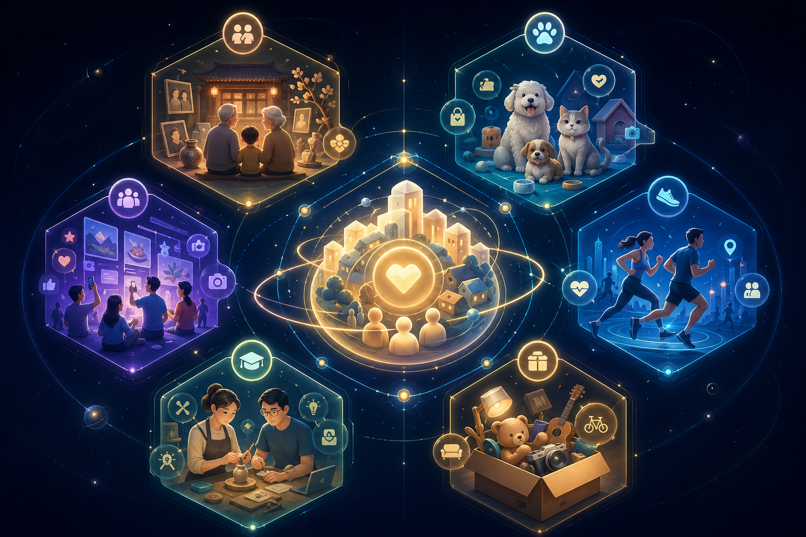
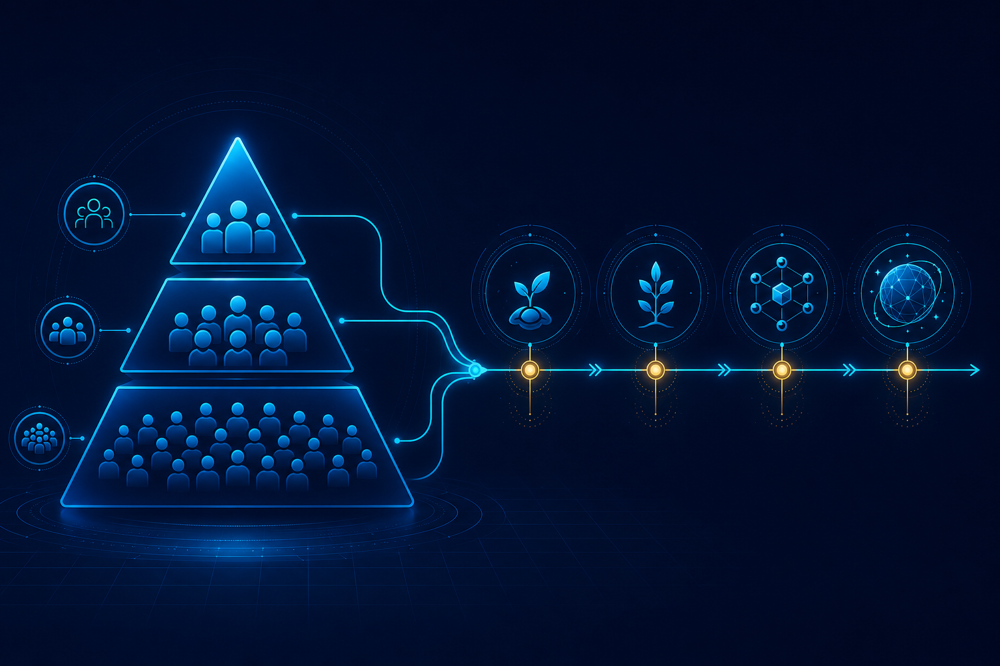

# 创客星球(CGHub)（Creators Galaxy Hub(CGHub)）

> 品牌命名：中文统一使用“创客星球(CGHub)”，英文统一使用“Creators Galaxy Hub(CGHub)”。英文版见：`docs/07-english/CGHub_Business_Ecosystem_Whitepaper_V2_EN.md`。

## 商业生态系统白皮书

> **版本：V2.0 深度版**
> **愿景：天下大同、万物共生**
> **使命：创新实践人类命运共同体蓝图，为人类文明的未来形态探路**
> **理念：敬天爱人、革知善行、至简至美**
> **价值观：诚信尊重、包容感恩、厚德自强**
> **Slogan：点燃创客之光，点亮未来梦想**
> **状态：待进一步细化**  


---

## 【前言】这是属于超级个体的时代

2024年，被称为"AI超级个体"元年。

一个人，一台电脑，一个AI助手，可以完成过去一个团队才能完成的工作。

**个体户工作室、OPC一人公司、个人IP品牌、AI超级个体工作室**——这些概念正在席卷整个互联网。

罗永浩说："超级个体是一个人就是一家公司。"

李一舟说："AI时代，每个人都应该学会用AI把自己变成一支军队。"

而我们说：

> **创客星球(CGHub)，是人类文明未来方向的探索基地，人类命运共同体的创新实践。**

在这里，你不需要雇佣团队，不需要融资千万，不需要背负压力。你只需要：

- 一个想法（可以价值百万）
- 100元启动资金
- 一群志同道合的同行者

**创客星球(CGHub)，为AI时代的超级个体而生。**

---

## 【摘要】Abstract

**创客星球(CGHub)**（Creators Galaxy Hub(CGHub)）是一个基于"AI+Web3+共同富裕理念"的创新实践平台，探索人类文明的未来形态。

我们深度研究了知识星球（知识变现社群）、Web3的DAO治理模型、以及本地生活服务平台的商业逻辑，结合AI超级个体的时代趋势，打造出这套独特的商业生态系统。

**核心创新：**

1. **轻启动** — 100元即可参与一个子项目，零门槛创业实验
2. **社群共创** — 不是平台喂用户，而是用户共建社区
3. **裂变激励** — 三级分销+内容贡献奖励，让推广者和贡献者赚到
4. **代币经济** — 双代币体系（MKT+STAR），为未来Web3化预留全套接口
5. **DAO治理** — 社区成员投票决定平台未来，真正的去中心化
6. **AI赋能** — 智能匹配、内容生成、数据分析，降低运营成本

**为什么现在入场？**

- 本地生活服务市场3万亿+，且持续增长
- AI工具极大降低创业门槛，超级个体时代来临
- Web3基础设施逐渐成熟，合规路径日趋清晰
- 邻里信任经济存在巨大空白

---

## 【创客星球(CGHub)宣言】

### 致每一个看到这里的人

---

当生产力高度发展
当AI接管了重复劳动
当物质不再匮乏

**人与人之间，还需要争夺什么？**

---

### 丛林法则，早已过时

**社会达尔文主义** — 那是一个物质匮乏时代的产物。

你争我夺、弱肉强食、零和博弈——
这是生产力不够发达时，人类被迫选择的生存方式。

**但今天，时代已经变了。**

AI让一个人可以完成过去一个团队的工作
机器让物质生产的边际成本趋近于零
互联网让信息的传播不再有壁垒

**生产力已经跑到了生产关系前面。**

---

### 一种全新的生产关系，正在诞生

这不是谁拍脑袋想出来的理想
这是历史发展的**必然趋势**

当生产力高度发展，人与人之间的差异
只剩下：

> **你愿意付出多少努力，你去创造多少价值**

而不是：
> 你比谁更强，你把谁踩在脚下

---

### 创客星球(CGHub)在做什么？

我们不是在做技术投机
我们是在用**先进的AI生产力**
结合**全新的Web3生产关系**
服务于**共同富裕的目标**

这不是空想，这正在被代码实现

---

### 我们的承诺

**参与者即股东** — 不管你持有多少，你都是共建者

**创造即确权** — 你的每一份贡献都会被记录，都将获得回报

**规则即代码** — 智能合约自动执行，平台无权单方面修改

**利益即共享** — 先行者开放邀请，后来者随时可加入

**天下大同，不是理想，而是一条正在走的路**

---

### 这是人类命运共同体的具体实践

**共同富裕** — 不是少数人富，是大家一起富

**人类命运共同体** — 不是零和博弈，是共赢生态

**天下大同** — 不是空洞的口号，是生产关系变革的必然结果

这不是我们在改变世界
是时代召唤我们站出来
去证明：

> **人可以不需要互相厮杀**
> **人可以帮助彼此，共同成就**

---

### 欢迎你，加入这条路

先行者不是高高在上
后来者不是低人一等

我们只是比更多人
早一步认识到：

**这个时代，已经不需要丛林法则了**

**创客星球(CGHub)**

**让创业更简单，让邻里更信任**

**让天下大同，从理想变为现实**

---

> *这不是一个人的帝国*
> *这是一群人的远征*
> *你，来吗？*

---

## 【核心理念】一次生产力与生产关系的革命


### 这是马克思主义的基本原理

> "生产力决定生产关系，生产关系反作用于生产力。"
> — 马克思主义政治经济学

**当生产力发展到一定阶段，必须要求生产关系随之变革。**

这，不是预测。
这，是历史规律。

---

### 第一次工业革命 → 蒸汽机 → 资本主义生产关系

瓦特改良蒸汽机 → 生产力大爆发 → 资产阶级登上历史舞台 → 资本主义生产关系确立

### 第二次工业革命 → 电气 → 垄断资本主义

发电机、内燃机 → 生产力再爆发 → 托拉斯、跨国公司出现 → 垄断资本主义生产关系

### 第三次信息革命 → 互联网 → 平台资本主义

计算机、互联网 → 生产力飞跃 → 巨头平台崛起 → 中心化的平台资本主义

### 第四次智能革命 → AI → ？？？

AI工具爆发 → 个人生产力暴增 → 一个人等于一支军队 → **旧的平台资本主义还能适应吗？**

---

### 答案已经写在美国的天空上

2024年，美国电力消耗暴涨。
AI数据中心与民争电。
工厂因为缺电停工。
普通人因为AI失业。

**这不是技术问题，这是生产关系问题。**

生产力已经跑到了生产关系前面：
- AI让一个人可以完成一个团队的工作
- 但这个人创造的财富，依然被平台和资本拿走
- 普通人依然被困在"打工者"的框架里

于是，美国司法部门开始出手：
要求AI发展要考虑"普惠"、"民生的利益"。
**这本质上是什么？**
**是生产关系的调整。**

---

### 中国给了另一种答案

**共同富裕** — 不是少数人富，而是大家一起富。

**为人民服务** — 发展的目的是为了人民。

**人类命运共同体** — 不是零和博弈，而是共赢生态。

这不是口号，这是指导思想的底层逻辑。

而Web3、区块链、DAO——
这些技术，本质上就是**生产关系的技术化表达**：

| 生产关系要素 | Web3表达 |
|------------|---------|
| 所有权 | 私钥确权 |
| 契约关系 | 智能合约 |
| 信用记录 | 链上不可篡改 |
| 分配机制 | 代码自动执行 |
| 治理结构 | DAO投票 |

**技术不是目的，技术和思想的结合，才是真正改变世界的力量。**

---

### 创客星球(CGHub)在做什么？

我们不是在做技术投机。
我们是在用**先进的AI生产力**，结合**新的Web3生产关系**，服务于**共同富裕的目标**。

```
AI生产力 × Web3生产关系 × 共同富裕理念
                 ↓
          创客星球(CGHub)
```

我们相信：
- **价值创造者**应该**拥有价值**
- **贡献者**应该**获得回报**
- **参与者**应该**成为主人**

这不是空想，这正在被代码实现。

---

### 我们的承诺

1. **参与者即股东** — 不管你持有多少代币，你都是创客星球(CGHub)的共建者
2. **创造即确权** — 你的每一份贡献都会被记录，都将获得回报
3. **规则即代码** — 智能合约自动执行，平台无权单方面修改规则
4. **退出即清算** — 如果你选择离开，你贡献的价值不会消失

**这不是乌托邦，这是我们正在用代码构建的现实。**

---

## 第一章：愿景与使命

### 1.1 AI时代：超级个体的崛起

2023-2024年，ChatGPT、Midjourney、Claude等AI工具爆发，彻底改变了内容生产和商业运营的方式。

**过去：** 一条短视频需要编剧、拍摄、剪辑、运营至少4个人。
**现在：** 一个人+AI工具，2小时完成。

**这意味着：**

- 个人生产力大幅提升
- 小团队可以挑战大公司
- "一人公司"从概念变为现实
- 超级个体的时代真正到来

**超级个体的三大特征：**

| 特征 | 说明 |
|------|------|
| AI生产力 | 用AI工具放大个人能力 |
| 个人品牌 | 通过内容建立影响力和信任 |
| 社群变现 | 不依赖平台，直接服务粉丝 |

**创客星球(CGHub)，正是为探索者提供：**
- 创新实践工具
- 社群协作基础设施
- 裂变增长机制
- 未来Web3化的价值确权

---

### 1.1X AI时代一人公司更需要新组织范式


> "AI时代，一人公司盛行，还需要团队吗？还需要组织吗？"
> 
> 这个问题，暴露了对新时代最常见的误解。

很多人以为：既然一个人加 AI 就能完成过去一个团队的工作，那么组织就不再重要了。

但这只看到了 AI 对个人生产力的放大，没有看到一个项目从“能做”到“做成”，还需要传播网络、信任传递、协作共识和价值分配。

**AI解决的是“做事”的问题，但解决不了“成事”的问题。**

| 层面 | AI能解决什么 | AI不能单独解决什么 |
|---|---|---|
| **执行层** | 写代码、写文案、做设计、分析数据 | **市场信任、裂变传播、网络效应** |
| **个人层** | 一个人完成过去一个团队的工作 | 一个人的影响力和触达半径有限 |
| **工具层** | 放大个人能力 | 能力不会自动扩散成组织势能 |
| **商业层** | 低成本做出产品雏形 | 让更多人参与、共建、推广、分配 |

所以，最关键的判断是：

```text
AI = 做事工具
创客星球(CGHub) = 成事组织

一个人 + AI = 能做
一个人 + AI + 创客星球(CGHub)组织 = 能做大
```

**超级个体 = 超级IP + AI数字员工。** 但一个孤立的超级个体，仍然会遇到三大上限：

1. **传播上限** — AI可以生成内容，但无法自动形成真实的人际裂变和长期口碑。
2. **信任上限** — 一个人的背书有限，1000个超级个体互相背书，才能形成网络级信任。
3. **分配上限** — 如果生产力升级了，但生产关系仍停留在平台抽佣、老板分配、中心化确权，新增价值仍会被旧结构拿走。

这就是为什么裂变和传播，依然需要组织；为什么 AI 越强，越需要新的组织范式。

但这里说的组织，不是回到传统公司制，而是走向 **去中心化共创网络**：

| 传统公司 | 创客星球(CGHub)新组织范式 |
|---|---|
| 雇佣制 | 共创制 |
| 老板中心 | 项目/共识中心 |
| 员工执行 | 创客自主参与 |
| 平台分配 | 规则/智能合约分配 |
| 用户消费 | 参与者即股东 |
| 价值被平台沉淀 | 贡献被记录并确权 |

**这不是在否定一人公司，而是在回答：一人公司之后，下一步是什么？**

> 超级个体解决的是生产力问题。  
> 创客星球(CGHub)解决的是生产关系问题。  
> **一人公司 + 创客星球(CGHub) = AI时代完整创业闭环。**

AI让普通人第一次拥有“做事”的能力；创客星球(CGHub)让普通人的事被看见、被传播、被放大、被确权、被分配。

因此，**AI时代，一人公司越盛行，越需要新的组织范式革命。**

> 延伸论述见：`docs/06-arguments/AI时代一人公司更需要新组织范式.md`

---

### 1.2 本地生活的万亿市场机会

根据艾瑞咨询数据，2024年中国本地生活服务市场规模突破**3万亿**，预计2025年将达到4万亿。

**市场痛点与我们的解决方案：**

| 痛点 | 现状 | 创客星球(CGHub)的解法 |
|------|------|----------------|
| 邻里互不认识 | 住对门不认识 | LBS就近匹配，真实社交 |
| 获客成本高 | 小微创业者投广告无效 | 社区裂变，口碑传播 |
| 平台抽佣重 | 美团抽20-30% | 智能合约低抽佣 |
| 信任成本高 | 闲鱼纠纷多 | 实名认证+LBS验证 |
| 信息不对称 | 不知道邻居有什么技能 | AI精准匹配 |
| 资源浪费 | 孩子用品用完就扔 | 闲置共享，减少浪费 |

**我们的核心逻辑：**

> 真实地理位置 × 真实社交关系 × 就近见面 = 低成本、高信任

### 1.3 知识星球模式深度借鉴

我们深度研究了知识星球（创立9年、3千万用户、7万+社群）的运营方法论，借鉴了以下核心机制：

**1.3.1 社群漏斗模型**

```
免费内容（公众号/抖音）
    ↓ 筛选
免费私域（微信群）
    ↓ 筛选
付费社群（知识星球）
    ↓ 深耕
私董会/核心圈子
```

**关键洞察：** 越往漏斗底部，人越少，但价值越高、连接越深、付费意愿越强。

**创客星球(CGHub)的漏斗设计：**

```
免费体验（工具功能）
    ↓ 价值认可
付费参与（100元子项目）
    ↓ 深度参与
核心创客（发起项目+担任志愿者）
    ↓ 治理参与
DAO成员（STAR持有者投票治理）
```

**1.3.2 定价策略（来自知识星球数据）**

| 星球类型 | 主流定价区间 |
|---------|------------|
| 副业赚钱类 | 300-1000元/年 |
| 技能学习类 | 100-500元/年 |
| 兴趣爱好类 | 50-300元/年 |
| 行业交流类 | 200-800元/年 |

**我们的100元定价逻辑：**
- 低于行业最低价，降低参与门槛
- 不是"年费"而是"一次性参与"
- 对应的是"创客积分"而非"年费订阅"
- 便于后续裂变和项目叠加参与

**1.3.3 内容运营机制（精华沉淀）**

| 机制 | 说明 |
|------|------|
| 置顶帖 | 星球规则+内容索引，新用户第一眼看到 |
| 精华内容 | 优质内容标记精华，形成知识库 |
| 标签系统 | 内容打标签，便于检索和分类 |
| 作业/打卡 | 提升参与感和粘性 |
| 问答互动 | 星主/嘉宾答疑，增强连接 |

**创客星球(CGHub)将借鉴：**
- 精华内容奖励MKT积分
- 标签系统便于内容沉淀
- 打卡机制用于工具类产品（遛狗打卡、运动打卡）
- 问答系统用于技能互助板块

**1.3.4 社群共创模式**

知识星球7年经验总结：好的社群不是星主一个人喂内容，而是**大家一起共建**。

**创客星球(CGHub)的共创设计：**

- 不是我们服务用户，而是用户服务用户
- 发起人可以设置"管理员/志愿者"
- 优质贡献者可以获得STAR治理代币
- UGC内容是生态繁荣的核心

---

## 【第二章】项目矩阵：意林社区



### 2.1 意林社区定位

**意林社区**是创客星球(CGHub)孵化的旗舰项目，定位于：

> **基于LBS的本地生活邻里真实社交平台**

**核心理念：**

> 方便就近见面，低成本，省时间，节能环保

**三大核心价值：**

1. **工具价值** — 解决实际问题（遛狗打卡、喂猫提醒、运动记录）
2. **社交价值** — 认识真实邻居，建立信任关系
3. **交易价值** — 闲置交换、技能悬赏、本地服务

### 2.2 四大子项目矩阵

#### 项目一：新时代家风建设与传承

**方向：** 家庭/社区层面的文化传承

**产品形态：**
- 家族档案（族谱、照片、视频）
- 家风故事（UGC分享）
- 家训打卡（每日践行）
- 家族活动（节日聚会组织）

**发展路径：** 工具 → 社区 → 平台

**目标用户：** 有传统文化认同感的家庭，尤其是有老人的家庭

---

#### 项目二：宠物经济（遛狗喂猫/宠物服务）

**方向：** 宠物服务 + 社交 + 电商

**三大板块：**

| 板块 | 功能 | 变现方式 |
|------|------|---------|
| 工具 | 遛狗打卡、喂猫提醒、体检提醒 | 会员订阅（高级功能） |
| 社交 | 宠物相亲、遛狗组队、养宠交流 | 广告、导流 |
| 电商 | 宠物零食、用品推荐 | CPS分成 |

**产品功能设计：**

```
【遛狗打卡】
├── GPS轨迹记录
├── 遛狗计时
├── 打卡排行榜（月冠军）
├── 分享到朋友圈海报
└── 遛狗搭子匹配

【喂猫提醒】
├── 定时提醒设置
├── 喂食记录
├── 猫咪体重追踪
├── 疫苗/驱虫提醒
└── 猫咪健康报告

【宠物社交】
├── 宠物档案（照片+性格标签）
├── 附近宠物匹配
├── 宠物相亲（配对分享）
├── 遛狗组队
└── 宠物知识百科
```

**核心价值：** 用户粘性极高（养宠物是长期行为）、情感消费意愿强、社交裂变天然

---

#### 项目三：体育社交运动

**方向：** 运动记录 + 运动社交 + 体育产业

**聚焦策略：** 先从跑友切入，再扩展到健身房、球类运动

**产品功能设计：**

```
【跑步工具】
├── 跑步轨迹记录
├── 配速/里程统计
├── 跑步成绩挑战
├── 跑步路线推荐
└── 跑步数据分析报告

【运动社交】
├── 附近跑友匹配
├── 约跑组队
├── 马拉松报名
├── 跑团创建
└── 运动打卡挑战赛

【延伸产业对接】
├── 运动鞋服品牌入驻
├── 体育活动报名
├── 运动保险
└── 健身房导流
```

**变现路径：**
- 阶段1：工具会员（记录/分析功能）
- 阶段2：活动报名抽佣
- 阶段3：运动品牌CPS
- 阶段4：运动数据变现

---

#### 项目四：闲置共享 + 技能互助

**方向：** 邻里闲置物品交换 + 技能服务悬赏

**三大板块：**

**板块A：闲置共享**

| 功能 | 说明 |
|------|------|
| 发布闲置 | 拍照+描述+定价，就近展示 |
| 智能匹配 | AI推荐附近可能感兴趣的人 |
| 安全交易 | 平台担保，确认收货后放款 |
| 信用评价 | 交易后互评，建立邻里信任 |

**定价逻辑：**
- 闲置物品定价低（10-100元区间为主）
- 邻居心理预期：便宜/送人都行
- 对卖家：省去闲鱼发布麻烦
- 对买家：就近拿取，省时环保

**板块B：技能互助**

| 技能类型 | 示例 | 悬赏金额参考 |
|---------|------|-------------|
| 生活服务 | 接孩子、遛狗、搬家帮忙 | 30-100元 |
| 专业咨询 | 法律、财务、技术问题 | 50-500元 |
| 教育培训 | 辅导孩子、兴趣教学 | 50-200元 |
| 宠物服务 | 临时照看宠物、宠物美容 | 50-200元 |

**悬赏流程：**
```
发布任务（描述+金额）→ 平台托管金额 → 邻居接单 → 完成服务 → 确认放款
```

**板块C：本地话题UGC**

- 邻里八卦、话题讨论
- 社区新闻、本地资讯
- 兴趣小组、话题标签
- 丰富生态，提升日活

---

### 2.3 子项目合并机制

**为什么可以合并？**

- 所有子项目都基于LBS和本地社交
- 用户可以在多个子项目中活跃
- 合并后用户价值倍增（同一个用户=遛狗用户+闲置用户+运动用户）
- 数据打通后AI匹配更精准

**合并条件：**
- 各子项目独立运行到一定规模
- 用户量达到合并阈值（待定）
- DAO投票通过

**合并时的股权处理：**
```
假设：子项目A估值100万，子项目B估值50万
合并后意林社区估值 = A + B + 合并溢价（20-50%）
各子项目持有者按比例转换为意林社区股份
```

---

## 【第三章】创客星球(CGHub)平台机制

### 3.1 参与机制设计

**创客星球(CGHub)采用"创客积分（MKT）"作为参与凭证：**

| 参与方式 | 金额 | 获得 |
|---------|------|------|
| 加入创客星球(CGHub) | 100 MKT | 获得创客资格+首批项目参与权 |
| 加入子项目 | 100 MKT/个 | 获得该项目股份+推广权 |
| 发起新项目 | 免费发起 | 获得项目股份+推广佣金 |

**权益说明：**
- 创客资格：可参与平台活动、有资格成为志愿者/管理员
- 项目股份：该项目收益的分红权
- 推广权：推荐他人加入获得裂变佣金

### 3.2 三级裂变激励机制

**核心逻辑：** 让推广者赚到钱，让参与者有动力拉人

#### 第一级：直接推荐

```
A推荐B加入项目 → A获得B支付额的20%佣金
```

#### 第二级：间接推荐

```
A推荐B，B推荐C → A获得C支付额的5%佣金
```

#### 第三级：社区贡献奖励

```
A发布的内容被加精华 → A获得5-50 MKT
A帮助解答问题 → A获得10 MKT
A参与平台活动 → A获得奖励MKT
```

**生财有术的启发：**

> "每加入100人，星球涨价100元"——制造稀缺感和紧迫感

**创客星球(CGHub)借鉴：**
- 每个子项目设置阶梯价格
- 早加入者享受更低价格
- 到达一定人数后涨价
- 涨价收益归属项目方

### 3.3 发起人激励机制

**成为项目发起人的条件：**
- 拥有创客资格（MKT 100）
- 提交项目计划书
- 平台审核通过
- 承诺参与运营

**发起人权益：**

| 权益 | 说明 |
|------|------|
| 项目股份 | 发起人获得项目总股份的15-30% |
| 推广佣金 | 每有人参与，发起人获得15% |
| 优先上市 | 项目优先在平台展示 |
| 资源对接 | 平台协助对接资源 |

**发起人义务：**
- 负责项目日常运营
- 定期发布项目进展
- 维护社群氛围
- 接受平台审计

### 3.4 内容贡献激励机制

**UGC内容奖励体系：**

| 内容类型 | 奖励MKT | 条件 |
|---------|---------|------|
| 精华主题 | 20 MKT | 被设为精华 |
| 优质回复 | 5 MKT | 被设为精选回复 |
| 每日签到 | 1 MKT | 连续签到额外奖励 |
| 话题发起 | 10 MKT | 话题参与人数>10 |
| 帮助成功 | 30 MKT | 技能悬赏被完成确认 |

**知识星球经验：**
> "如果内容被加精华，就退门票钱"——让贡献者有回报

**创客星球(CGHub)借鉴：**
- 月度优质贡献者获得STAR治理代币
- 年度贡献榜TOP10获得平台股份奖励
- 优质创客可晋升为"星荐官"

### 3.5 会员等级体系

**创客等级（星阶体系）：**

| 等级 | 名称 | 条件 | 权益 |
|------|------|------|------|
| Lv.1 | **星芒** | 注册 | 可浏览、购买 |
| Lv.2 | **星灿** | MKT≥500 | 可发言、参与讨论 |
| Lv.3 | **星烨** | 内容≥10+被点赞≥50 | 可发起项目 |
| Lv.4 | **星辉** | 社区志愿者 | 可参与DAO投票 |
| Lv.5 | **星耀** | STAR≥10000 | 可竞选理事 |

> **命名释义：** 芒→灿→烨→辉→耀 —— 从微光到极致光芒。五级递进：芒（草）为起点，灿/烨（火）为进阶，辉/耀（光）为极致

---

## 【第四章】代币经济系统（Web3预备）


> **重要说明：** 当前版本为"Web3预备版"。代币机制已完整设计，但**暂不上链**，仅作为积分系统在平台内运行。待法律法规明确、Web3基础设施成熟后，再迁移至区块链。届时现有积分将按1:1映射为链上代币。

### 4.1 双代币体系设计

**为什么是双代币？**

单一代币模型的问题：
- 功能代币（Utility Token）价格波动大
- 权益代币（Security Token）面临监管风险

双代币分离优势：
- MKT负责功能支付，波动不影响长期价值
- STAR负责治理权益，稳定积累社区治理权

| 代币 | 符号 | 类型 | 属性 |
|------|------|------|------|
| 创客积分 | MKT | 功能型 | 可流通，价值波动 |
| 星钻 | STAR | 权益型 | 长期增值，治理权 |

### 4.2 MKT（创客积分）详细设计

#### 4.2.1 获取途径

| 方式 | 数量 | 说明 |
|------|------|------|
| 充值购买 | 1元=1MKT | 官方渠道 |
| 邀请用户 | 20 MKT/人 | 直接邀请 |
| 间接邀请 | 5 MKT/人 | 被邀请者再邀请 |
| 发布精华内容 | 20 MKT/条 | 被设为精华 |
| 优质回复 | 5 MKT/条 | 被精选 |
| 完成任务 | 10-100 MKT | 平台活动 |
| 交易返利 | 交易额5% | 悬赏/闲置交易 |

#### 4.2.2 消耗场景

| 场景 | 数量 | 说明 |
|------|------|------|
| 参与子项目 | 100 MKT | 每个子项目 |
| 发布悬赏任务 | 任务金额10% | 平台托管费 |
| 会员升级 | 50-500 MKT/月 | 高级功能 |
| 内容推广 | 10-100 MKT | 置顶/推荐 |
| 商城兑换 | 按商品定价 | 虚拟/实物商品 |

#### 4.2.3 通胀与销毁机制

**通胀控制：**
- 每日新增MKT = 昨日交易额 × 5%
- 设置单日最大产出上限

**销毁机制：**
- 每笔交易抽10%手续费，手续费100%销毁
- 平台收益的30%用于回购销毁MKT
- 重大活动奖励由销毁池支出

**通缩模型：**
```
当销毁速度 > 产出速度 → MKT进入升值通道
当销毁速度 < 产出速度 → 启动产出调节机制
```

### 4.3 STAR（星钻）详细设计

#### 4.3.1 获取途径（仅通过贡献获取，不可购买）

| 方式 | 数量 | 说明 |
|------|------|------|
| 早期参与 | 1000 STAR | 创客星球(CGHub)早期成员 |
| 项目合并 | 按比例兑换 | 子项目合并时 |
| 月度贡献 | 100-500 STAR | 内容贡献榜TOP |
| 年度贡献 | 1000-5000 STAR | 年度贡献榜TOP |
| DAO提案采纳 | 200 STAR | 提案被投票通过 |
| 担任志愿者 | 200 STAR/月 | 平台志愿者 |

#### 4.3.2 消耗场景

| 场景 | 数量 | 说明 |
|------|------|------|
| DAO提案押金 | 100 STAR | 提案通过可退还 |
| 投票权抵押 | 10 STAR/票 | 投票后释放 |
| 优先参与权 | 500 STAR | 新项目早期参与 |
| 竞选理事 | 10000 STAR | 锁定一年 |

#### 4.3.3 价值捕获

STAR的价值来源于：

1. **平台收益分红** — 平台利润的30%按STAR持有量分红
2. **治理权** — 重大决策投票权
3. **优先权益** — 新功能优先体验
4. **生态增值** — 平台估值增长带动STAR升值

### 4.4 平台收益分配与用户分红机制

> **核心设计理念：** 平台不是少数人的印钞机，而是所有贡献者的共同事业。谁为平台创造价值，谁就分享平台的成长红利。

#### 4.4.1 平台收入来源

```
【收入来源分类】

1. 工具市场交易抽成（8%）
   → 平台撮合交易收取

2. 船票收入（¥99/年）
   → 会员订阅费

3. 知识产品收入
   → 书籍、小报童、课程等

4. 项目协作服务费
   → 托管费、验证费等
```

#### 4.4.2 收入分配规则（核心公式）

```
┌─────────────────────────────────────────────────────┐
│           平台总收入（税后）                          │
│                                                     │
│   ┌──────────┐    ┌───────────────────────────┐   │
│   │ 运营成本  │    │      可分配利润            │   │
│   │ （预留）  │    │  （= 总收入 - 运营成本）    │   │
│   └──────────┘    └───────────────────────────┘   │
│                                                     │
│                        │                            │
│          ┌─────────────┼─────────────┐             │
│          ▼             ▼             ▼             │
│    ┌──────────┐ ┌──────────┐ ┌──────────┐        │
│    │ 核心团队  │ │ 投资者   │ │ 公共基金池 │        │
│    │   50%    │ │   25%    │ │    25%    │        │
│    └──────────┘ └──────────┘ └──────────┘        │
│                                    │                │
│                         ┌──────────┴──────────┐     │
│                         ▼                      ▼     │
│                   ┌──────────┐          ┌────────┐  │
│                   │ 用户分红 │          │ 事业合伙人│ │
│                   │   50%   │          │   50%   │  │
│                   │(=公共基金│          │(按STAR持│  │
│                   │  池的50%)│          │有量分配)│  │
│                   └──────────┘          └────────┘  │
└─────────────────────────────────────────────────────┘
```

**简化公式：**

```
用户可分配总额 = 可分配利润 × 25%

每个用户的分红 = 用户可分配总额 ×（用户积分 ÷ 全平台总积分）
```

#### 4.4.3 积分体系设计

**MKT积分 = 贡献积分（功能型，可流通）**

| 行为 | 获得积分 | 说明 |
|------|---------|------|
| 发布优质内容（被精华） | +20 MKT | 每次 |
| 发布优质回复 | +5 MKT | 每次 |
| 发起话题（参与>10人） | +10 MKT | 每次 |
| 帮助解答被采纳 | +30 MKT | 每次 |
| 每日签到（连续） | +1-5 MKT | 连续天数越多越多 |
| 邀请新用户注册 | +20 MKT | 直接邀请 |
| 邀请用户付费（船票） | +50 MKT | 付费转化 |
| 参与平台活动 | +10-100 MKT | 活动奖励 |

**STAR积分 = 治理积分（权益型，不可购买，只能贡献获得）**

| 行为 | 获得积分 | 说明 |
|------|---------|------|
| 早期参与（创客星球上线前） | +1000 STAR | 一次性 |
| 每月内容贡献榜TOP10 | +100-500 STAR | 按排名 |
| 年度贡献榜TOP10 | +1000-5000 STAR | 按排名 |
| DAO提案被采纳 | +200 STAR | 每次 |
| 担任平台志愿者 | +200 STAR/月 | 持续 |
| 项目发起成功 | +500 STAR | 一次性 |

#### 4.4.4 分红机制细则

**计算规则：**

```
用户分红权重 = 用户STAR持有量 / 全平台STAR总流通量

用户实际分红 =（可分配利润 × 12.5%）× 用户分红权重
```

**发放规则：**

| 项目 | 规则 |
|------|------|
| 分红周期 | 每季度发放一次 |
| 分红门槛 | STAR持有量≥100（不足100不参与当期分红） |
| 分红形式 | MKT积分发放 |
| 锁仓机制 | 早期（上线3年内）分红收益的50%锁仓6个月 |
| 税收处理 | 由用户自行申报 |

**分红示例：**

```
假设：
- 某季度平台可分配利润 = ¥100,000
- 全平台STAR总流通量 = 1,000,000 STAR
- 用户A持有 STAR = 10,000 STAR

计算：
- 用户可分配总额 = ¥100,000 × 25% = ¥25,000
- 用户A的分红 = ¥25,000 ×（10,000 / 1,000,000）
- 用户A本季度分红 = ¥250 MKT
```

#### 4.4.5 估值与增值机制

**估值模型：**

```
平台估值 = 平台年度可分配利润 × 估值倍数

估值倍数参考：
- 早期（0-1年）：3-5倍
- 成长期（1-3年）：5-10倍
- 成熟期（3年+）：10-20倍
```

**用户收益来源：**

```
用户持有STAR的潜在收益：

1. 分红收益
   → 平台利润分红（每季度）

2. 增值收益
   → 平台估值增长 → STAR对应权益增值
   → 可在后期按估值变现或转让

3. 治理收益
   → 参与DAO投票，影响平台发展方向
   → 间接推动STAR价值增长
```

#### 4.4.6 上链后的实现

**暂不上链阶段（当前）：**

```
- 用数据库记录每个用户的MKT和STAR
- 分红计算由平台运营方执行
- 定期公示积分总数和分红金额
- 用户可随时查询自己的积分和分红记录
```

**上链后（未来）：**

```
- MKT映射为功能型代币（Utility Token）
- STAR映射为权益型代币（Equity Token）
- 分红逻辑写入智能合约
- 自动执行，无需人工干预
- 分红直接从合约地址转给用户钱包
- 不可篡改，不可赖账
```

**关键区别：**

| 阶段 | 优势 | 局限 |
|------|------|------|
| 积分阶段 | 灵活可调，快速迭代 | 依赖运营方信用 |
| 上链阶段 | 代码即法律，不可篡改 | 需合规，迁移成本 |

#### 4.4.7 防止机制被滥用的设计

```
【问题1：刷积分】
→ 限制每个IP/设备每日签到次数
→ 优质内容需人工或算法审核
→ 积分获得设置冷却时间

【问题2：积分购买】
→ STAR不可购买，只能贡献获得
→ MKT可购买，但购买不参与分红权重
→ 分红权重只看STAR，不看MKT

【问题3：分红后立即抛售】
→ 早期分红锁仓50%（6个月）
→ 鼓励长期持有，而非短期套利

【问题4：核心团队控制过多】
→ 核心团队50%分配写入智能合约（未来）
→ 重大决策需DAO投票
→ 章程修改需>60% STAR持有者同意
```

---

### 4.5 上链路径规划

**当前阶段（2025年）：Web3预备版**
- MKT/STAR仅作为积分系统运行
- 不上链，不涉及token交易
- 为未来上链预留全部接口

**第二阶段（合规化完成后）：混合模式**
- MKT映射为链上功能性代币（公链）
- STAR映射为治理代币（DAO）
- 智能合约部署在Polygon/BSC等低gas链

**第三阶段（完全Web3）：**
- 开放去中心化交易所（DEX）上架MKT
- STAR持有者可参与平台利润分红
- 跨链互操作

---

## 【第五章】DAO治理架构



### 5.1 为什么需要DAO？

传统的平台治理：
- 老板说了算
- 用户没有发言权
- 规则随时可以改
- 收益被平台独享

DAO模式的优势：
- 社区共同决策
- 规则写入智能合约，不可篡改
- 贡献者共享平台增长红利
- 激励与平台长期绑定

### 5.2 三层治理结构

```
┌─────────────────────────────────────────────┐
│            创客星球(CGHub) DAO                      │
│         Creators Galaxy Hub(CGHub) DAO                      │
├─────────────────────────────────────────────┤
│                                             │
│   【第一层：全员治理】                      │
│   所有STAR持有者可参与                       │
│   - 重大战略投票                            │
│   - 理事选举                                │
│   - 章程修改                                │
│                                             │
│   【第二层：理事会治理】                    │
│   7名理事，STAR持有者选举                   │
│   - 日常运营决策                            │
│   - 预算审批                                │
│   - 新项目立项                              │
│   - 争议裁决                                │
│                                             │
│   【第三层：执行团队】                      │
│   平台运营方                                │
│   - 执行理事会决议                          │
│   - 日常运营管理                            │
│   - 向社区定期汇报                          │
│                                             │
└─────────────────────────────────────────────┘
```

### 5.3 理事会选举机制

**选举周期：** 每年一次

**参选条件：**
- STAR持有量≥10000
- 持有时间≥6个月
- 过去一年无违规记录

**选举流程：**
```
公告 → 候选人申请 → 公示 → 投票 → 结果公布 → 就职
```

**理事会职责：**
- 召集和主持DAO会议
- 执行DAO决议
- 审批预算和支出
- 任命各委员会成员
- 代表DAO对外签约

### 5.4 治理事项分级

| 事项 | 类型 | 投票门槛 | 通过条件 | 说明 |
|------|------|---------|---------|------|
| 修改白皮书核心条款 | 重大 | 50万STAR参与 | 75%+同意 | 不可轻易修改 |
| 新代币发行 | 重大 | 50万STAR参与 | 70%+同意 | 影响代币经济 |
| 子项目合并 | 重大 | 该项目50%用户参与 | 60%+同意 | 涉及股份转换 |
| 智能合约升级 | 一般 | 20万STAR参与 | 60%+同意 | 技术升级 |
| 生态基金使用 | 一般 | 10万STAR参与 | 50%+同意 | 日常运营 |
| 活动预算 | 常规 | 理事会决定 | — | 无需公投 |

### 5.5 争议解决机制

**三级仲裁体系：**

| 级别 | 适用范围 | 处理方式 |
|------|---------|---------|
| 第一级：AI仲裁 | 简单争议（≤100MKT） | AI系统自动裁决 |
| 第二级：社区仲裁 | 中等争议（100-10000MKT） | 随机抽取5名评审投票 |
| 第三级：法务介入 | 重大争议（>10000MKT或涉法） | 提交法务团队/司法机构 |

---

## 【第六章】AI赋能体系

### 6.1 AI在创客星球(CGHub)的角色

**不是取代人，而是赋能人。**

我们不做一个"AI替代一切"的乌托邦，而是让AI成为超级个体的得力助手。

### 6.2 六大AI能力模块

#### 模块一：智能匹配引擎

**基于LBS+兴趣+信用+行为的精准匹配**

```
用户画像 = {
  位置: 经纬度 → 附近N公里
  兴趣: 养宠/运动/闲置/家风
  行为: 活跃时间/浏览记录/交易记录
  信用: 实名认证/交易评价/社区贡献
}

AI匹配 = 基于上述画像 + 实时需求 + 场景识别
       → 推荐最合适的遛狗搭子/闲置买家/技能服务者
```

**应用场景：**
- 遛狗搭子匹配（位置+宠物类型+时间合适）
- 闲置买家推荐（谁可能需要这个物品）
- 技能接单者匹配（谁有这个技能+好评+就近）
- 内容推荐（基于兴趣的UGC内容分发）

#### 模块二：内容生成助手

**AIGC降低创作门槛**

| 功能 | 说明 |
|------|------|
| 闲置物品描述 | 拍照AI生成商品描述 |
| 活动文案 | 一键生成活动海报文案 |
| 话题引导 | 自动生成话题讨论点 |
| 内容润色 | 优化发布内容吸引力 |
| 私信回复 | 智能客服解答常见问题 |

#### 模块三：信用评估系统

**多维度AI信用评分**

| 维度 | 权重 | 评估因素 |
|------|------|---------|
| 身份认证 | 20% | 实名认证、手机、芝麻信用 |
| 交易记录 | 30% | 成交数、好评率、纠纷率 |
| 社区贡献 | 25% | 发布量、互动量、帮助他人 |
| LBS验证 | 15% | 常驻位置、居住地认证 |
| AI风控 | 10% | 行为异常检测、反欺诈 |

**信用分应用：**
- 高信用用户优先推荐
- 高信用用户享受更低抽佣
- 低信用用户受限（限流/禁言）

#### 模块四：运营分析助手

**数据驱动决策**

- 用户增长分析（漏斗转化、留存分析）
- 内容效果分析（阅读/互动/转化）
- 交易健康度监控（异常交易预警）
- 竞品分析（同类平台动态追踪）
- 运营建议（基于AI分析的优化方案）

#### 模块五：智能客服

**7×24小时AI客服**

- 常见问题自动解答
- 交易纠纷初步调解
- 新用户引导
- 投诉建议分类处理

#### 模块六：社区氛围AI

**维护健康的社区环境**

- 内容审核（识别违规内容）
- 恶意行为检测（识别刷屏/广告/诈骗）
- 情绪预警（识别负能量内容并提醒）
- 优质内容识别（挖掘潜力UGC）

---

## 【第七章】商业模式与利益分配

### 7.1 收入来源

| 收入来源 | 占比 | 说明 |
|---------|------|------|
| 交易抽佣 | 40% | 闲置交易5%、技能悬赏10% |
| 会员订阅 | 25% | 高级工具功能会员 |
| 广告收入 | 15% | 商户推广、精准投放 |
| CPS分成 | 10% | 电商导流、课程分销 |
| 数据服务 | 10% | 脱敏数据分析报告 |

### 7.2 利益分配机制

**三级分配模型：**

```
【第一级：裂变推广者】
A推荐B → A获得B支付额的20%

【第二级：项目发起人】
项目参与费分配：
- 15% → 发起人（运营激励）
- 10% → 平台（服务费）
- 75% → 项目资金池（用于项目发展）

【第三级：平台层面】
平台利润分配（每季度）：
- 30% → MKT回购销毁
- 30% → STAR持有者分红
- 20% → 生态基金（开发者/志愿者激励）
- 20% → 运营基金（技术/运维）
```

### 7.3 城市合伙人计划（待启动）

**背景：** 本地生活服务具有强地域性，需要本地人来运营

**城市合伙人权益：**
- 该城市所有交易抽佣的5%归合伙人
- 该城市项目优先试点权
- 城市独家运营权（签排他协议）
- 合伙人星级评定，享对应权益

**城市合伙人条件：**
- 当地有资源（社区关系、物业合作）
- 有运营能力（社群运营经验）
- 缴纳保证金（待定）
- 认同平台理念

---

## 【第八章】发展路线图

### Phase 1：种子期（0-6个月）

**目标：MVP验证，100名种子创客**

- [ ] 完成创客星球(CGHub)小程序MVP开发
- [ ] 上线意林社区首批子项目（家风传承、宠物经济）
- [ ] 招募100名种子创客用户
- [ ] 建立社群运营SOP
- [ ] 完成代币经济系统设计（不上链）
- [ ] 建立内容审核机制
- [ ] 启动DAO治理1.0规则制定

**验证指标：**
- 日活用户>100
- 付费用户>50
- 社群满意度>80%

### Phase 2：成长期（6-12个月）

**目标：扩大规模，验证商业模式**

- [ ] 上线闲置共享、技能互助功能
- [ ] 用户突破1万
- [ ] 孵化10个以上子项目
- [ ] 上线会员订阅功能
- [ ] 完成DAO治理1.0上线
- [ ] 实现月度盈亏平衡

**验证指标：**
- 日活用户>1000
- 付费用户>1000
- 月GMV>10万

### Phase 3：扩张期（12-24个月）

**目标：规模化复制，建立生态壁垒**

- [ ] 用户突破50万
- [ ] 覆盖20个以上城市
- [ ] 子项目突破50个
- [ ] 启动城市合伙人计划
- [ ] 上线AI智能匹配引擎2.0
- [ ] 完成MKT代币上链（合规后）
- [ ] 启动STAR持有者分红

**验证指标：**
- 日活用户>5万
- 付费用户>5万
- 年GMV>500万

### Phase 4：生态期（24个月+）

**目标：成为本地生活Web3基础设施**

- [ ] 用户突破100万
- [ ] 100+城市覆盖
- [ ] 开放第三方开发者API
- [ ] 完成完全去中心化（DAO接管）
- [ ] 跨链互操作（Polygon/BSC）
- [ ] 成立创客星球(CGHub)基金会

---

## 【第九章】风险与应对

### 9.1 已知风险

| 风险类型 | 描述 | 应对策略 |
|---------|------|---------|
| 监管风险 | Web3/代币可能面临政策不确定性 | 合规优先，暂不上链，法务护航 |
| 技术风险 | 智能合约漏洞（未来上链后） | 多轮审计，悬赏漏洞发现 |
| 市场风险 | 用户增长不及预期 | MVP验证，快速迭代 |
| 竞争风险 | 大厂入局本地生活 | 差异化定位，社区壁垒 |
| 信用风险 | 交易纠纷 | AI仲裁+LBS验证+托管 |
| 内容风险 | 违规内容/诈骗 | AI审核+人工复核 |
| 社区风险 | 社群氛围恶化 | 志愿者体系+分级治理 |

### 9.2 竞争优势

1. **先发优势** — 本地生活+Web3细分赛道领先
2. **社区壁垒** — 真实邻里关系难以复制
3. **AI赋能** — 降低运营成本，提升匹配效率
4. **代币激励** — 用户增长与价值共享绑定
5. **轻资产** — MVP验证后再大规模投入
6. **时代趋势** — AI超级个体时代，顺势而为

---

## 【第十章】如何参与

### 10.1 加入创客星球(CGHub)

**只需100元，你将获得：**

1. ✅ MKT创客积分100枚
2. ✅ 创客资格认证
3. ✅ 首批子项目参与权
4. ✅ 成为意林社区种子用户
5. ✅ 未来平台增长红利参与权
6. ✅ 结识100位志同道合的创业者

### 10.2 加入方式

```
第一步：关注微信公众号【创客星球(CGHub)MakerStar】
第二步：回复"加入"获取参与方式
第三步：支付100元获得创客资格
第四步：进入创客社群，参与项目讨论
第五步：选择感兴趣的子项目加入
```

### 10.3 发起你的项目

**如果你有好想法：**

1. 提交项目计划书
2. 平台审核通过
3. 发布你的子项目
4. 获得15-30%项目股份
5. 开始推广招募

### 10.4 成为城市合伙人

**如果你在当地有资源：**
- 联系客服申请
- 提交资质证明
- 签订合作协议
- 开始城市拓展

---

## 【附录】术语表

| 术语 | 全称 | 解释 |
|------|------|------|
| MKT | 创客积分 | Maker Token，功能型代币 |
| STAR | 星钻 | 治理型代币，权益证明 |
| DAO | 去中心化自治组织 | Decentralized Autonomous Organization |
| LBS | 基于位置的服务 | Location Based Service |
| MVP | 最小可行产品 | Minimum Viable Product |
| CPS | 成交付费 | Cost Per Sale |
| UGC | 用户生成内容 | User Generated Content |
| AIGC | AI生成内容 | AI Generated Content |
| 超级个体 | — | AI时代一个人就是一支团队 |
| OPC | One Person Company | 一人公司，AI时代个人创业的法律实体 |
| 艺人公司 | — | 个人IP化的公司形态 |

---

## 【附录】白皮书版本历史

| 版本 | 日期 | 更新内容 |
|------|------|---------|
| V1.0 | 2025年 | 初稿完成 |
| V2.0 | 2025年 | 深度版：知识星球机制借鉴、DAO治理、代币经济、AI赋能、超级个体时代背景 |

---

## 【免责声明】

1. 本白皮书仅供参考，不构成投资建议
2. 代币经济系统设计可能根据监管政策和社区意见进行调整
3. 创客星球(CGHub)暂不涉及代币上链，现阶段仅为积分系统
4. 参与有风险，请谨慎决策
5. 平台保留对白皮书内容的最终解释权

---

> **创客星球(CGHub)，让创业更简单，让邻里更信任。**
> 
> **Creators Galaxy Hub(CGHub) — Where Super Individuals Connect.**
