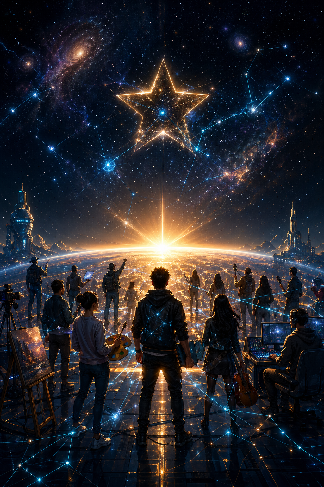

# 创客星球 · 海报文案集
## 设计参考资料

---

## 【主海报01】I Have a Dream



### 中文版

```
┌─────────────────────────────────────────────────────────┐
│                                                         │
│                    我有一个梦想                          │
│                                                         │
│        不是一个老板说了算的平台                          │
│        不是一个资本独享的帝国                            │
│                                                         │
│        而是一个                      │
│        每个人都是主人的系统                              │
│                                                         │
│        你的每一次参与                                    │
│        都被区块链永久记录                                 │
│                                                         │
│        你的每一份贡献                                    │
│        都将获得应有的回报                                 │
│                                                         │
│        不是承诺                                          │
│        是代码                                           │
│        是智能合约                                       │
│        是不可篡改的真相                                  │
│                                                         │
│                    这就是创客星球                         │
│                                                         │
│              Maker Star — Where Super Individuals Meet   │
│                                                         │
└─────────────────────────────────────────────────────────┘
```

---

### 英文版（国际传播用）

```
┌─────────────────────────────────────────────────────────┐
│                                                         │
│                    I Have a Dream                       │
│                                                         │
│        Not a platform where one boss decides            │
│        Not an empire where capital takes all            │
│                                                         │
│        But a system                                    │
│        Where everyone is an owner                       │
│                                                         │
│        Every participation                              │
│        Recorded forever on blockchain                   │
│                                                         │
│        Every contribution                                │
│        Rewarded fairly                                  │
│                                                         │
│        Not a promise                                    │
│        It's code                                        │
│        It's smart contracts                             │
│        It's immutable truth                             │
│                                                         │
│                    This is Maker Star                    │
│                                                         │
│              Maker Star — Where Super Individuals Meet   │
│                                                         │
└─────────────────────────────────────────────────────────┘
```

---

## 【主海报02】中心化 vs 去中心化

```
┌─────────────────────────────────────────────────────────┐
│                                                         │
│          过去的互联网                                    │
│          The Old Internet                               │
│                                                         │
│   ┌─────────────────┐    用户贡献数据、口碑、传播        │
│   │    巨头平台     │ ──────────────────────────→     │
│   │   拿走一切      │                                 │
│   └─────────────────┘    用户只得到"免费服务"         │
│                                                         │
│                                                         │
│          创客星球的互联网                                │
│          The Maker Star Internet                        │
│                                                         │
│   ┌─────────────────┐                                  │
│   │   创客星球       │    参与者贡献 → 智能合约记录     │
│   │   每个人都是    │ ──────────────────────────→     │
│   │   主人          │    按贡献比例分配价值             │
│   └─────────────────┘                                  │
│                                                         │
│          不是平台的              是每个人的              │
│          是大家的                都是每个人的            │
│                                                         │
└─────────────────────────────────────────────────────────┘
```

---

## 【主海报03】价值创造者 = 价值拥有者

```
┌─────────────────────────────────────────────────────────┐
│                                                         │
│     过去的平台                                          │
│                                                         │
│         创造价值的人 ──×──→ 获得回报                    │
│              ↓                                          │
│         被平台抽走                                       │
│                                                         │
│                                                         │
│     创客星球                                            │
│                                                         │
│         创造价值的人 ──✓──→ 获得回报                   │
│              ↓                     ↑                   │
│         区块链记录              智能合约自动分配          │
│                                                         │
│                                                         │
│        用代码保证公平                                    │
│        用数学实现正义                                    │
│                                                         │
└─────────────────────────────────────────────────────────┘
```

---

## 【主海报04】为什么是100元？

```
┌─────────────────────────────────────────────────────────┐
│                                                         │
│              不是门槛                                    │
│              是筛选                                      │
│                                                         │
│     筛选真正相信的人                                     │
│     筛选愿意共建的人                                     │
│     筛选志同道合的同行者                                  │
│                                                         │
│     ────────────────────────────────────               │
│                                                         │
│     我们不要10000个围观群众                               │
│     我们要100个合伙人                                    │
│                                                         │
│     100元                                               │
│     买一张船票                                          │
│     买一个圈子的入场券                                   │
│     买一个与时代同行者的资格                              │
│                                                         │
│     创客星球合伙人                                       │
│     正在招募中                                          │
│                                                         │
└─────────────────────────────────────────────────────────┘
```

---

## 【主海报05】参与即确权

```
┌─────────────────────────────────────────────────────────┐
│                                                         │
│      当你在创客星球                                      │
│                                                         │
│      发布一条内容                      →  记录         │
│      分享一个想法                      →  记录         │
│      帮助一个陌生人                    →  记录         │
│      完成一笔交易                      →  记录         │
│      邀请一个朋友                      →  记录         │
│      为社区做贡献                      →  记录         │
│                                                         │
│      ─────────────────────────────────                 │
│                                                         │
│      这些记录                    不可篡改                │
│      这些贡献                    永久存在                │
│      这些价值                    属于你                  │
│                                                         │
│      不是平台说"谢谢你"                                  │
│      是代码说"你值得"                                    │
│                                                         │
│                    参与即确权                           │
│                    Contribution = Ownership              │
│                                                         │
└─────────────────────────────────────────────────────────┘
```

---

## 【主海报06】超级个体宣言

```
┌─────────────────────────────────────────────────────────┐
│                                                         │
│              AI时代                                      │
│              超级个体宣言                                │
│                                                         │
│                                                         │
│      我不再是一个人在战斗                                │
│      我不再是一个人在黑暗中摸索                          │
│      我不再是一个人的超级个体                            │
│                                                         │
│      我加入了创客星球                                    │
│      我找到了志同道合的人                                │
│      我参与了社区的共建                                  │
│      我共享平台发展的红利                                │
│                                                         │
│      我的贡献被记录                                      │
│      我的价值被确认                                      │
│      我是这个平台的主人                                  │
│                                                         │
│                                                         │
│      我是创客星球合伙人                                  │
│      I am a Maker Star Partner                          │
│                                                         │
└─────────────────────────────────────────────────────────┘
```

---

## 【系列海报07】6大项目招募

### 宠物经济海报

```
┌─────────────────────────────────────────────────────────┐
│                                                         │
│              🐕 🐈                                      │
│                                                         │
│      谁说爱宠物的人                                      │
│      不能用宠物赚钱？                                    │
│                                                         │
│      遛狗打卡 ─ 记录每一次陪伴                          │
│      喂猫提醒 ─ 记录每一份责任                          │
│      宠物社交 ─ 找到同城的铲屎官                        │
│      宠物电商 ─ 变现你的影响力                          │
│                                                         │
│      创客星球·宠物经济                                  │
│      正在招募合伙人                                     │
│                                                         │
└─────────────────────────────────────────────────────────┘
```

### 体育社交海报

```
┌─────────────────────────────────────────────────────────┐
│                                                         │
│                    🏃 🏋️                               │
│                                                         │
│      每一次奔跑                                          │
│      都值得被记录                                       │
│                                                         │
│      跑友匹配 ─ 找到附近的跑步搭子                      │
│      运动打卡 ─ 记录每一次突破                          │
│      马拉松报名 ─ 一起挑战自我                          │
│      运动社交 ─ 认识同城运动爱好者                      │
│                                                         │
│      创客星球·体育社交                                  │
│      正在招募合伙人                                     │
│                                                         │
└─────────────────────────────────────────────────────────┘
```

### 闲置共享海报

```
┌─────────────────────────────────────────────────────────┐
│                                                         │
│                    🔄                                   │
│                                                         │
│      孩子的婴儿车                                       │
│      用完就扔？太可惜了                                  │
│      送给邻居？人家正好需要                             │
│                                                         │
│      闲置共享 ─ 邻里间的不浪费                          │
│      技能互助 ─ 悬赏让邻居帮你办事                      │
│      本地话题 ─ 聊我们的社区                            │
│                                                         │
│      节能环保                                           │
│      就近见面                                           │
│      信任交易                                           │
│                                                         │
│      创客星球·闲置共享                                  │
│      正在招募合伙人                                     │
│                                                         │
└─────────────────────────────────────────────────────────┘
```

---

## 【设计规范】

### 配色方案

| 用途 | 颜色 | 色值 |
|------|------|------|
| 主色 | 深蓝渐变 | #1a1a2e → #16213e |
| 强调色 | 金色 | #f5a623 |
| 辅助色 | 科技蓝 | #00d4ff |
| 背景色 | 深黑 | #0f0f0f |
| 文字色 | 纯白 | #ffffff |

### 字体建议

- 标题：思源黑体 Bold / Noto Sans SC Bold
- 副标题：思源黑体 Medium
- 正文：思源黑体 Regular
- 英文：Montserrat Bold

### 视觉风格

- 风格：科技感 + 温暖人文
- 深色背景 + 亮色文字
- 加入区块链/网格/节点等元素
- 但要避免过度"币圈"风格

### 尺寸规格

| 用途 | 尺寸 |
|------|------|
| 朋友圈分享 | 1:1 或 4:5 |
| 小报童封面 | 16:9 |
| 知识星球背景 | 1920×600 |
| 头像 | 圆形 400×400 |

---

## 【设计工具推荐】

如需自己制作海报：

1. **Canva** — 创客星球模板可直接套用
2. **Figma** — 如需精细设计
3. **Midjourney** — 生成背景图配图
4. **PS/AI** — 专业设计

---

*本文件为创客星球海报设计参考资料*
*Maker Star © 2025*
